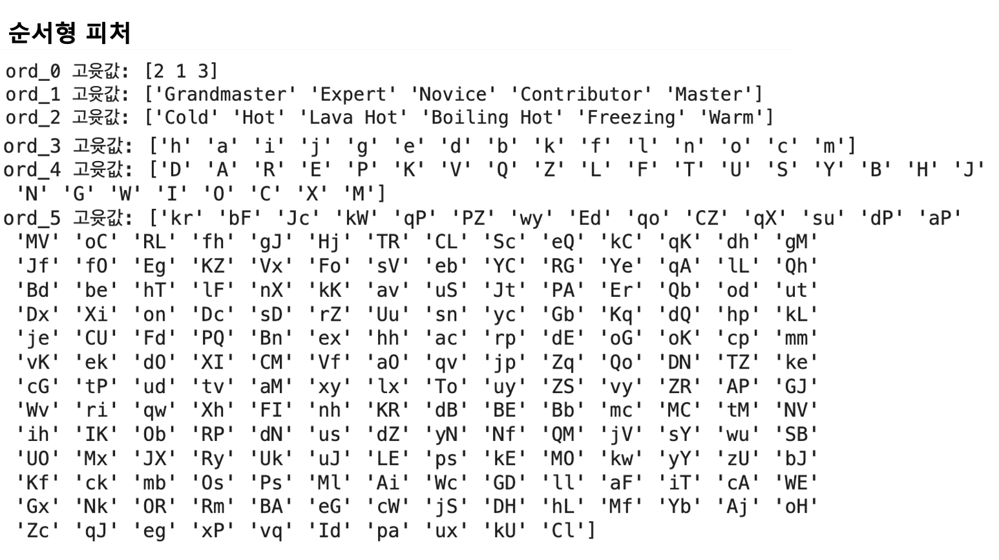

# ML Project - 범주형 데이터 이진분류
> [프로젝트 kaggle 링크](https://www.kaggle.com/competitions/cat-in-the-dat/submissions)

## 탐색적 데이터 분석
### 데이터 둘러보기
**학습 및 테스트 데이터**
<p align="center">
  
</p>


### 피처 요약본 만들기

피처별 데이터 타입, 결측값 개수, 교윳값 개수, 실제 입력값 등을 정리한 표

1. 피처별 데이터 타입 DataFrame 생성
2. 인덱스 재설정 후 열 이름 변경
3. 결측값 개수, 고윳값 개수, 1 ~ 3행 입력값 추가

#### 피처별 데이터 타입 DataFrame 생성
- DataFrame 객체에서 dtypes를 호출하면 피처별 데이터 타입을 반환해준다.

#### 인덱스 재설정 후 열 이름 변경
- reset_index()로 인덱스를 재설정한다.
- rename() 함수를 활용해 열 이름을 '피처'로 변경한다.

#### 결측값 개수, 교윳값 개수, 1 ~ 3행 입력값 추가
- isnull(): 결측값의 포함여부를 True, False로 반환하는 함수
- nunique(): 피처별 고윳값 개수를 구하는 함수
- values: Series 객체에서 값만 추출하기 위해 사용

#### 피처 요약표 생성 함수

```python
import pandas as pd

def resumetable(df):
    print(f'데이터셋 형상: {df.shape}')
    summary = pd.DataFrame(df.dtypes, columns=['데이터 타입'])
    summary = summary.reset_index()
    summary = summary.rename(columns={'index': '피처'})
    summary['결측값 개수'] = df.isnull().sum().values
    summary['고윳값 개수'] = df.nunique().values
    summary['첫 번째 값'] = df.loc[0].values
    summary['두 번째 값'] = df.loc[1].values
    summary['세 번째 값'] = df.loc[2].values

    return summary
```

#### 피처 확인
<p align="center">
  
</p>

- 순서형 피처의 순서를 파악하기 위해 순서형 피처의 고윳값을 출력해본다.
- 고윳값 개수가 적은 0 ~ 2 피처를 확인한다.

<p align="center">
  
</p>

#### 피처 요약본 해석
- bin_0 ~ 4 : 이진 피처
    - 교윳값 2개
        - 0 ~ 2: int64(0 or 1)
        - 3 ~ 4: object(T or F, Y or N)
    - 머신러닝 모델은 숫자만 인식하기 때문에, 모델링할 때 T, Y는 1로, F, N은 0으로 인코딩하자.

- nom_0 ~ 9 : 명목형 피처
    - 0 ~ 4까지는 고윳값 6개 이하
    - 5 ~ 9까지는 많은 고윳값
        - 의미를 알 수 없는 값들이 입력되어 있다.

- ord_0 ~ 5 : 순서형 피처
    - 0: 고윳값이 모두 숫자
    - 1: 캐글 등급
    - 2: 춥고 더운 정도
    - ord_3, ord_4, ord_5 : 알파벳순으로 고윳값 순서를 매김

- day, month : 날짜 피처
    - day: 7개의 숫자로 구성되어 있으며, 요일을 나타낸다고 짐작할 수 있다.
    
- target : 0, 1의 범주형 데이터


### 데이터 시각화

#### 타깃값 분포
**To-do**
- 타깃값 분포를 통해 데이터가 얼마나 불균형한지 파악한다. 이를 통해, 부족한 타깃값에 더 집중해 모델링이 이루어질 수 있도록 한다.
- countplot()은 범주형 데이터의 개수를 확인할 때 주로 사용하므로, 이를 통해 타깃값 0과 1의 개수를 파악한다.
- 타깃값 비율을 표시한다.

**ax.patches**
- 'ax축을 구성하는 그래프 도형 객체 모두를 담은 리스트'

*수치형 데이터의 분포를 파악할 땐 주로 displot()을 사용한다.*

<p align="center">
  
</p>

- 7: 3의 비율을 가지고 있다.


#### 이진 피처 분포
**To-do**
- 이진 피처의 분포를 타깃값별로 따로 그려본다.
- 특정 고윳값이 특정 타깃값에 치우치는지 확인해본다.

<p align="center">
  
</p>

- 고윳값별로 나눠봐도 타깃값 0, 1의 분포가 대체로 7:3 수준으로 보여지는 것을 통해 이진 피처들은 특정 타깃값에 치우치지 않았음을 확인할 수 있다.


#### 명목형 피처 분포
**To-do**
- 명목형 피처 분포와 명목형 피처별 타깃값 1의 비율을 살펴본다.
- 5 ~ 9 피처까지는 고윳값의 개수가 많고 의미를 알 수 없기 때문에 0 ~ 4 피처까지만 시각화한다.

**교차분석표 생성 함수 만들기**

교차표(cross-tabulation) = 교차분석표
- 범주형 데이터 2개를 비교 분석하는 데 사용되는 표로, 각 범주형 데이터의 빈도나 통계량을 행과 열로 결합해놓은 표를 말한다.
- 명목형 피처별 타깃값 1 비율을 구하기 위해 사용된다.
- 판다스의 crosstab() 함수 사용

```python
def get_crosstab(df, feature):
    crosstab = pd.crosstab(df[feature], df['target'], normalize='index') * 100
    crosstab = crosstab.reset_index()
    return crosstab
```

**포인트플롯 생성 함수 만들기**
- 이미 카운트플롯이 그려진 축에 포인트플롯을 중복으로 그려준다.

```python
def plot_pointplot(ax, feature, crosstab):
    ax2 = ax.twinx() # x축은 공유하고 y축은 공유하지 않는 새로운 축 생성

    # 새로운 축에 포인트플롯 그리기
    ax2 = sns.pointplot(x=feature, y=1, data=crosstab, order=crosstab[feature].values, color='black', legend=False)
    ax2.set_ylim(crosstab[1].min()-5, crosstab[1].max()*1.1)
    ax2.set_ylabel('Target 1 Ratio(%)')
```

**피처 분포도 및 피처별 타깃값 1의 비율 포인트플롯 생성 함수 만들기**
```python
def plot_cat_dist_with_true_ratio(df, features, num_rows, num_cols, size=(15, 10)):
    plt.figure(figsize=size) # 전체 Figure 크기 설정
    grid = gridspec.GridSpec(num_rows, num_cols) # 서브플롯 배치
    plt.subplots_adjust(wspace=0.45, hspace=0.5) # 서브플롯 좌우/상하 여백 설정

    for idx, feature in enumerate(features):
        ax = plt.subplot(grid[idx])
        crosstab = get_crosstab(df, feature) # 교차분석표 생성

        # ax축에 타깃값 분포 카운트플롯 그리기
        sns.countplot(x=feature, data=df,
                      order=crosstab[feature].values,
                      color='skyblue',
                      ax=ax)

        write_percent(ax, len(df)) # 비율 표시

        plot_pointplot(ax, feature, crosstab) # 포인트플롯 그리기

        ax.set_title(f'{feature} Distribution') # 그래프 제목 설정
```

**결과**

<p align="center">
  
</p>

- 0 ~ 4 피처는 고윳값별로 타깃값 1의 비율이 서로 다르다.
 - '타깃값에 대한 예측 능력이 있음'을 의미한다.
 - 모두 모델링에 사용한다.
- 명목형 피처는 순서를 무시해도 되고 고윳값 개수가 적으므로 이후 원-핫 인코딩을 사용한다.

- 5 ~ 9 피처는 시각화하기 어렵다.
    - 우선 필요한 피처라고 가정하여 모델링을 진행한다.
        - 해당 피처들을 하나씩 제거하면서 성능이 좋아지는지 여부를 바탕으로 모델링에 사용할지말지를 결정할 수도 있다.
    - 고윳값 개수가 많지만, 피처들의 의미를 몰라 그룹화하기 어렵고, 전체 데이터 양이 많지 않기 때문에 원-핫 인코딩을 사용한다.


#### 순서형 피처 분포
**To-do**
- plot_cat_dist_with_true_ratio() 함수를 사용한다.
    - 0 ~ 3 피처는 고윳값이 15개 이하이므로 2행 2열의 그래프를 그린다.
    - 4 ~ 5 피처는 고윳값의 개수가 많으므로 2행 1열의 그래프를 그린다.

<p align="center">
  
</p>

- ord_1, ord_2의 피처 값들의 순서를 정렬한다.
- CategoricalDtype()
    - categories : 범주형 데이터 타입으로 인코딩할 값 목록
    - ordered : True로 설정하면 categories에 전달한 값의 순서가 유지된다.

*countplot() 함수의 order 파라미터에 순서를 전달하면 순서대로 그래프를 그리지만, 근본적으로 피처 자체에 순서가 지정된 것이 아니다.*

<p align="center">
  
</p>

<p align="center">
  
</p>

- ord_0, 1, 2, 3, 4, 5 모두 고윳값 순서에 따라 타깃값 1 비율도 비례해서 커진다는 것을 확인할 수 있다.
- 순서형 피처 모두 고윳값 순서에 따라 타깃값 1인 비율이 증가한다는 사실을 알 수 있으므로, 순서와 비율 사이에 상관관계가 있다는 것을 확인할 수 있다. 따라서, 모두 모델링 시 사용한다.


#### 날짜 피처 분포

<p align="center">
  
</p>

**분석**
- day 피처는 7개인 걸로 보아 요일이라고 추측된다.
    - 1 ~ 4에서는 타깃값 1의 비율이 줄어들고, 4 ~ 7에서는 비율이 증가한다.
- month 피처는 day 피처와 다소 반대되는 양상을 보이고 있다.

**주의 사항**
- 요일과 월 피처 모두 값이 숫자이다.
    - 머신러닝 모델은 숫자 값을 가치의 크고 작음으로 해석한다. 12월과 1월, 1월과 2월은 둘 다 한 달 차이지만 값으로 볼 때는 11과 1차이이다.
    - 삼각함수(sin, cos)를 사용해 인코딩하면 시작과 끝이 매끄럽게 연결되어 문제가 해결된다.
- 매년, 매월, 매주, 매일 반복되는 데이터를 순환형 데이터라고 부른다.

*요일, 월 피처에 원-핫 인코딩을 적용하는게 경진대회에서 성능이 좋았다.*

*데이터가 그리 크지 않아서 삼각함수 인코딩이 제대로 효과를 발휘하지 못했을 수 있다.*


## 베이스라인 모델

### 피처엔지니어링
- 데이터를 변환하는 작업으로, 일반적으로 훈련 데이터와 테스트 테이터에 공통으로 반영하기 위해 피처 엔지니어링 전에 두 데이터를 합쳤다가 끝나면 다시 나눠준다.
- 문자를 숫자로 변경시켜, 머신러닝 모델이 데이터를 인식할 수 있게 한다.

1. 원-핫 인코딩

2. 데이터 나누기
  -  검증 데이터 나누기


### 모델 훈련

**LogisticRegression()**
- max_iter : 모델의 회귀 계수를 업데이트하는 반복 횟수


### 모델 성능 검증

**To-do**
- 타깃 예측값과 실제 타깃값 사이의 ROC AUC를 구해본다.

**타깃값 예측 메서드 in 사이킷런**
- predict() : 타깃값 자체(0 or 1)를 예측
- predict_proba() : 타깃값의 확률(0일 확률, 1일 확률)을 예측

검증 데이터 ROC AUC : 0.7965

<p align="center">
  
</p>


## 성능 개선

**To-do**
1. 피처 맞춤 인코딩
  - 이진 피처, 순서형 피처(ord_1, ord2)는 수작업으로 인코딩
  - 순서형 피처(ord_3, ord_4, ord_5)는 ordinal 인코딩
  - 명목형 피처, 날짜 피처는 원-핫 인코딩

2. 피처 스케일링
    - 순서형 피처에만 적용
        - 이진 피처는 값이 두 개이기 때문에 0, 1로만 구성되고, 명목형 피처, 날짜 피처 또한 원-핫 인코딩 이후 0, 1로 구성될 것이기 때문. 즉, 이진 피처, 명목형 피처, 날짜 피처는 인코딩 후 이미 최솟값 0, 최댓값 1로 범위가 일치하기 때문에 스케일링을 하지 않아도 된다.

3. 하이퍼파라미터 최적화


### 데이터 합치기 & 이진 피처 인코딩

**To-do**
- bin_0, 1, 2는 이미 0과 1로 구성되어 있으니 생략
- bin_3, 4는 T or F, Y or N의 문자로 구성되어 있기 때문에 0과 1로 변경해준다.
    - map() 함수는 전달받은 딕셔너리나 함수를 Series의 모든 원소에 적용해 결과를 반환한다.

### 순서형 피처 인코딩

**To-do**
- ord_0: 이미 숫자로 구성되어 있으므로 생략
- ord_1, 2는 순서를 정해서 인코딩
- ord_3 ~ 5는 알파벳 순서대로 인코딩
    - 고윳값 개수가 많아 번거롭기 때문에 OrdinalEncoder() 사용

### 명목형 피처 인코딩

**To-do**
- 순서를 무시해도 상관없기 때문에 원-핫 인코딩을 적용한다.
    - 원-핫 인코딩을 하면 열 개수가 늘어나서 all_data에서 곧바로 인코딩할 수 없기 때문에 인코딩 된 명목형 피처를 별도 행렬에 저장하고, all_data에서 명목형 피처를 삭제한다.
    - OneHotEncoder는 희소 행렬을 CSR 형식으로 반환한다.

### 날짜 피처 인코딩

**To-do**
- 원-핫 인코딩을 적용한다.

### 피처 스케일링

#### 순서형 피처 스케일링

**To-do**
- min_max 정규화 적용

#### 인코딩 및 스케일링된 피처 합치기

**To-do**
- all_data와 따로 원-핫 인코딩 결과를 저장한 명목형 피처, 날짜 피처를 합한다.
    - 원-핫 인코딩 결과는 CSR 형식이므로 변환하여 맞춰준다. = scipy.sparse.csr_matrix()
- 합쳐진 후 500,000 x 16,306 이므로 DataFrame으로 처리하면 메모리 낭비가 심하기 때문에 CSR 형식을 그대로 사용한다.


#### 데이터 나누기 & 하이퍼파라미터 최적화

**To-do**
- 그리드서치를 활용하여 로지스틱 회귀 모델의 C, max_tier 파라미터를 최적화한다.
    - C: 규제 강도를 조절하는 파라미터로 값이 작을수록 규제 강도가 세진다.
    - 평가지표를 ROC AUC로 지정한다.

**결과**

- 최적 하이퍼파라미터:  {'C': 0.125, 'max_iter': 800, 'random_state': 42, 'solver': 'liblinear'}
- CPU times: user 7min 59s, sys: 5min 31s, total: 13min 31s
- Wall time: 10min

#### 모델 성능 검증
검증 데이터 ROC AUC : 0.8045

<p align="center">
  
</p>
