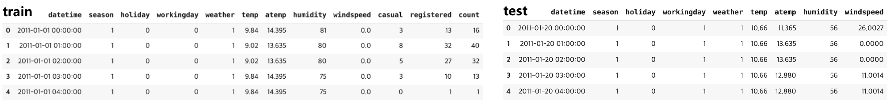
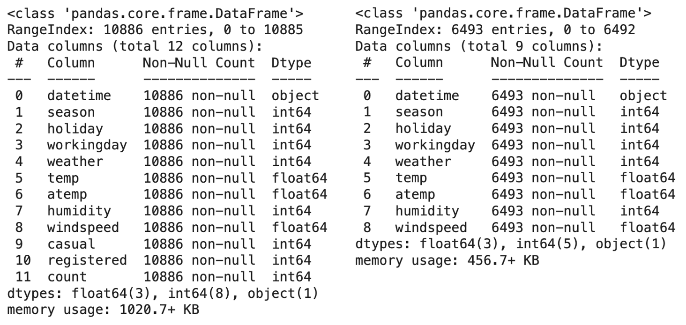
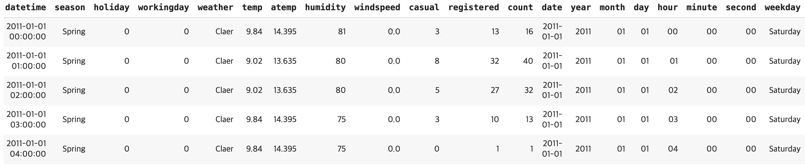
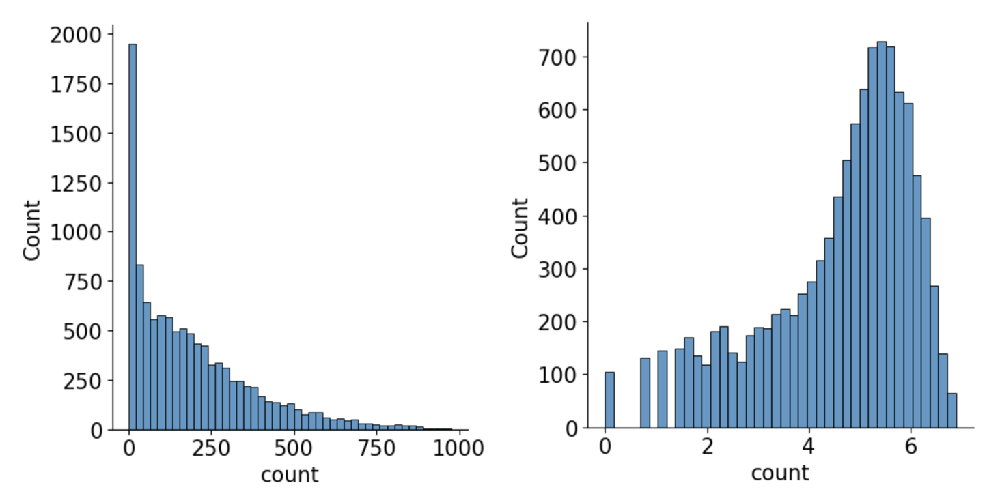
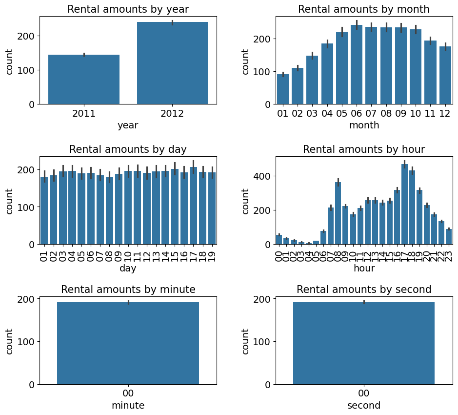
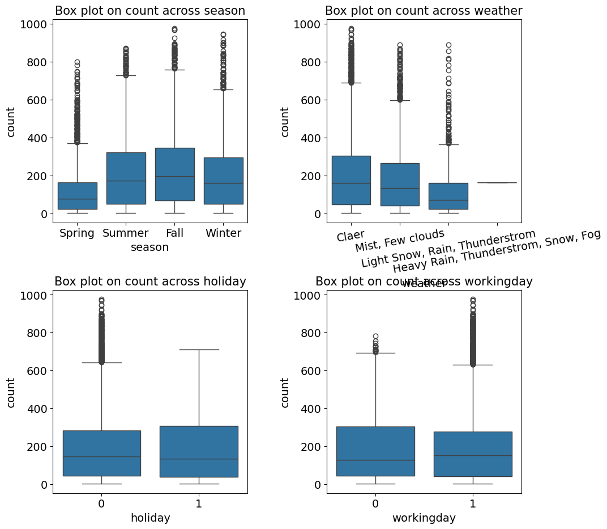
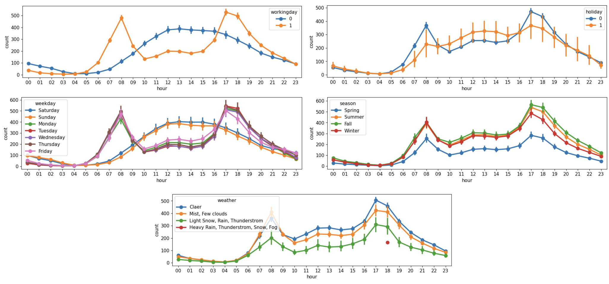
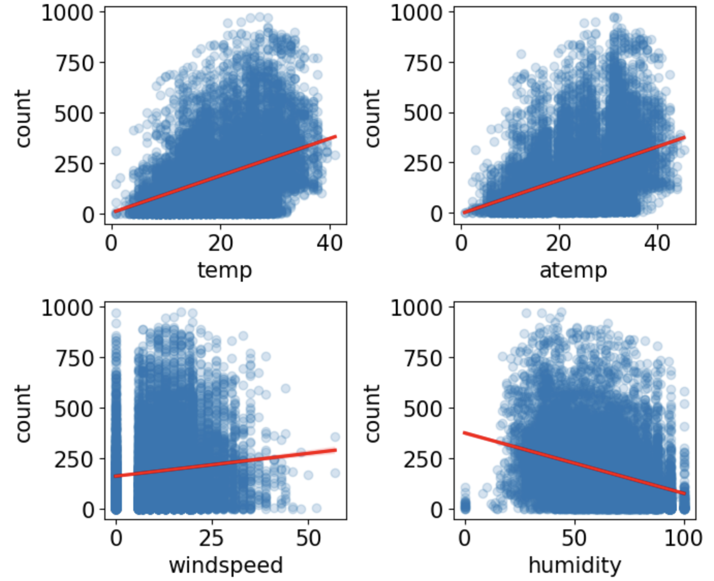
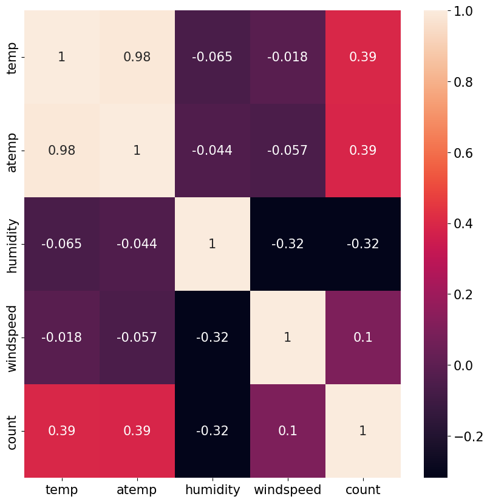

# ML Project - 자전거 수요 예측
> [프로젝트 kaggle 링크](https://www.kaggle.com/c/bike-sharing-demand)

## 탐색적 데이터 분석
### 데이터 둘러보기
**학습 및 테스트 데이터**

- 테스트 데이터에 casual과 registered 피처가 존재하지 않으므로 이후, 모델을 훈련할 때 해당 피처를 제외한다.

**학습, 테스트 데이터 정보**

  

- DataFrame 각 열의 결측값이 몇 개인지, 데이터 타입은 무엇인지 info()함수를 사용하여 파악한다.

### 피처 엔지니어링
데이터를 다양한 관점에서 시각화해보면 raw data 상태에서는 찾기 어려운 경향, 공통점, 차이 등을 찾을 수 있다. 하지만, datetime과 같은 일부 데이터는 시각화하기에 적합하지 않은 형태일 수도 있기 때문에 변환(피처 엔지니어링)을 해준다.

**datetime -> 데이터 타입: object**
- object 타입은 문자열 타입이라고 볼 수 있다.
- 연도, 월, 일, 시간, 분, 초로 구성되어 있기 때문에 세부적으로 분석하기 위해 구성요소별로 나누어본다.
  - date 피처가 제공하는 정보는 모두 year, month, day 피처에 존재하므로 추후 제거해준다.
- calendar와 datetime 라이브러리를 활용해 요일 피처를 문자로 만들어준다.
- 'season', 'weather' 피처의 경우 범주형 데이터로 이루어져있어 정확한 의미 파악이 힘들다. 시각화를 위해 의미가 잘 드러나도록 map() 함수를 사용하여 문자열로 변환한다.
  - 세 달씩 '월'을 묶으면 '계절'이 되므로, 지나친 세분화를 방지하기 위해 이후, season 피처만 남기고 month 피처는 제거해준다.

  

### 데이터 시각화
#### 분포도
**To-do**
- 타깃값의 분포를 확인하여, 훈련 시 타깃값을 그대로 사용할지 변환해 사용할지 파악한다.

  

결과 분석

- x축은 타깃값인 count, y축은 총 개수
- 타깃값(왼쪽)을 확인했을 때, count가 0에 몰려있다. 즉, 분포가 왼쪽으로 많이 편향되어 있다.
- 회귀 모델의 경우 데이터가 정규분포에 따라야 좋은 성능을 보이므로, 현재 타깃값을 그대로 사용해 모델링을 진행한다면 좋은 성능을 기대하기 어렵다.

- 접근방법 : **로그변환**
    - 데이터 분포를 정규분포에 가깝게 만들기 위해 많이 사용된다.
    - 데이터가 왼쪽으로 편향되어 있을 때 사용한다.
    - 간단하게 원하는 값에 로그를 취해준다.
    - 마지막에 지수변환을 하여 실제 타깃값인 count로 복원해야한다.

#### 막대 그래프
**To-do**
- 연도, 월, 일, 시, 분, 초별로 총 여섯 가지의 평균 대여 수량을 막대 그래프로 그려본다.

**Why?**
- 해당 피처들은 범주형 데이터이므로, 각 범주형 데이터에 따라 평균 대여 수량이 어떻게 다른지 파악하여 중요한 피처를 파악하고자 한다.

  

결과 분석

- '연도별 평균 대여 수량'
    - 2012년에 대여가 더 많았다.
- '월별 평균 대여 수량'
    - 대여 수량이 6월에 가장 많고 1월에 가장 적음을 알 수 있다.
    - 날씨가 따듯할 때, 많이 대여한다고 짐작할 수 있다.
- '일별 평균 대여 수량'
    - 뚜렷한 차이가 없다. 훈련 데이터에서는 1일 ~ 19일까지의 데이터가 존재하고, 이후는 테스트 데이터에 존재한다. 따라서, day는 피처로 사용하지 못한다.
- '시간별 평균 대여 수량'
    - 새벽에 가장 적게 대여하고, 아침 8시, 저녁 5~6시에 대여가 가장 많다.
    - 등하교, 출퇴근 길에 많이 이용한다고 짐작할 수 있다.
- '분, 초별 평균 대여 수량'
    - 아무 정도를 담고 있지 않다.
    - 훈련 데이터에 분, 초는 모두 0으로 기록되어 있으므로, 모델 훈련시 해당 피처는 사용하지 않는다.

#### 박스플롯
**To-do**
- 계절, 날씨, 공휴일, 근무일(범주형 데이터)별 대여 수량(수치형 데이터)을 박스플롯으로 나타낸다.

**Why?**
- 각 범주형 데이터에 따라 타깃값인 대여 수량이 어떻게 변하는지 알 수 있다.

  

 결과 분석 

- '계절별 대여 수량'
    - 봄에 가장 적고, 가을에 가장 많다.
- '날씨별 대여 수량'
    - 좋을 때 가장 많고, 안 좋을수록 수량이 적다. 우리의 직관과 일치한다.
- '공휴일별 대여 수량'
    - 0: 공휴일 아님, 1: 공휴일
    - 자전거 대여 수량의 중앙값은 거의 비슷하나, 공휴일이 아닐 때 이상치가 많다.
- '근무일 대여 수량'
    - 0: 근무일 아님, 1: 근무일
    - 근무일일 때, 이상치가 많다.

#### 포인트플롯
범주형 데이터에 따른 수치형 데이터의 평균과 신뢰구간을 점과 선으로 표시한다. 한 화면에 여러 그래프를 그려 서료 비교하기에 적합하다.

**To-do**
- 계절, 날씨, 공휴일, 요일, 근무일(범주형 데이터)별 평균 대여 수량(수치형 데이터)을 포인트플롯으로 나타낸다.

  

결과 분석

- 근무일에는 출퇴근 시간에 대여 수량이 많고, 쉬는 날에는 오후 12 ~ 2시가 가장 많다.
- 공휴일, 요일에 따른 플롯도 근무일 여부에 따른 포인트플롯과 비슷한 양상을 보인다.
- 가을에 가장 많이 대여하고, 봄에 가장 적게한다.
- 날씨가 좋을 때, 대여량이 가장 많다.
    - 폭우, 폭설 때 대여 건수가 있다. 이러한 이상치는 제거를 고려해보자.

#### 회귀선을 포함한 산점도 그래프
수치형 데이터 간 상관관계를 파악하는데 사용한다.

**To-do**

온도, 체감 온도, 풍속, 습도별 대여 수량을 그려본다.

  

결과 분석

- 온도와 체감 온도가 높을수록 대여 수량이 많다.
- 습도는 낮을수록 대여 수량이 많다.
- 풍속이 셀수록 대여 수량이 많다.
    - 자세히 보면 풍속이 0인 데이터가 많다. 관측치가 없거나 오류로 인해 기록됐을 가능성이 높다.
    - 결측값이 많이 존재하므로 그래프를 통해 풍속과 대여 수량의 상관관계를 파악하기 힘들다. 결측값을 다른 값으로 대체하거나 windspeed 피처 자체를 삭제하는 방향으로 생각하자.

#### 히트맵
데이터 간 관계를 색상으로 표현하여, 여러 데이터를 한눈에 비교하기 좋다.

**To-do**

수치형 데이터들의 상관관계를 확인해본다.

  

결과 분석

- temp와 count 간 상관계수는 0.39 즉, 양의 상관관계를 보인다.
    - 온도가 높을수록 수량이 많다.
- humidity와 count는 음의 상관관계를 보인다.
    - 습도가 낮을수록 수량이 많다.
- windspeed는 상관관계가 매우 약하므로, 제거하는 편이 좋다.

