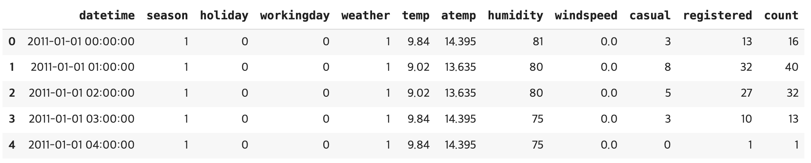
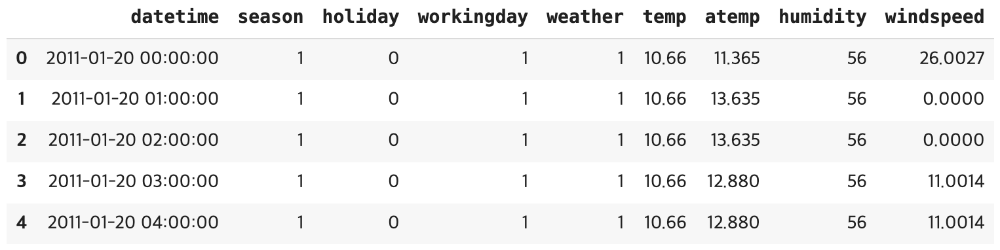

# ML Project - 자전거 수요 예측
> [프로젝트 kaggle 링크](https://www.kaggle.com/c/bike-sharing-demand)

## 탐색적 데이터 분석
### 데이터 둘러보기
학습 데이터

테스트 데이터

- 테스트 데이터에 casual과 registered 피처가 존재하지 않으므로 이후, 모델을 훈련할 때 해당 피처를 제외한다.

학습, 테스트 데이터 정보

- DataFrame 각 열의 결측값이 몇 개인지, 데이터 타입은 무엇인지 info()함수를 사용하여 파악한다.
